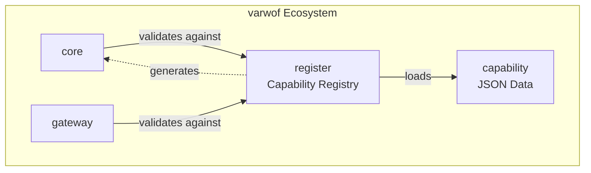

# varwof-register

> Capability Registry — standard capability definition, validation, and authz.json generation for fine-grained AI Agent permission control.

> ⚠️ **Preview** — Not for production use. APIs and features may change before official release.

[](LICENSE)
[](https://pkg.go.dev/github.com/varwof/register)

[中文](README_CN.md)

## What is varwof-register?

A registry of standard capability definitions for fine-grained AI Agent permission control. Capability specifications are carried by **executable JSON files** (capability.json), support PKCS#7 signatures, and can **generate authz.json authorization policies** (gen-authz tool).

## Quick Start

```bash
cd register

# List all capabilities
go run ./cmd/gen-authz -list varwof/core/v1.json varwof/gateway/v1.json

# Generate authz.json
go run ./cmd/gen-authz -out /tmp/authz.json varwof/core/v1.json varwof/gateway/v1.json

# Validate a capability
go run ./demo validate varwof/core:cert:issue

# Search capabilities
go run ./demo search issue
```

## Installation

```bash
go get github.com/varwof/register@v0.1.0
```

## Directory Structure

```
register/
├── schema.go / registry.go / validator.go
├── genauthz.go / gendocs.go / mincap.go
├── loader.go / sign.go / AI_PROMPT.md
├── cmd/{gen-authz,gen-docs,gen-capability,sign,verify}/
├── varwof/{core,gateway,constraint}/
├── oracle/mysql/
└── x-vendor/acme/
```

## Ecosystem



register is the **capability specification layer** of the varwof ecosystem, connecting capability (data) with core/gateway (runtime validation). This project is a member of the [Open Invention Network](https://openinventionnetwork.com/).

## Links

| | |
|---|---|
| Homepage | https://varwof.com |
| Community | https://varwof.org |
| IETF Draft | [draft-wei-aic-identity-cert](https://datatracker.ietf.org/doc/draft-wei-aic-identity-cert/) |
| License | Apache-2.0 |
| Member | [Open Invention Network](https://openinventionnetwork.com/) |
