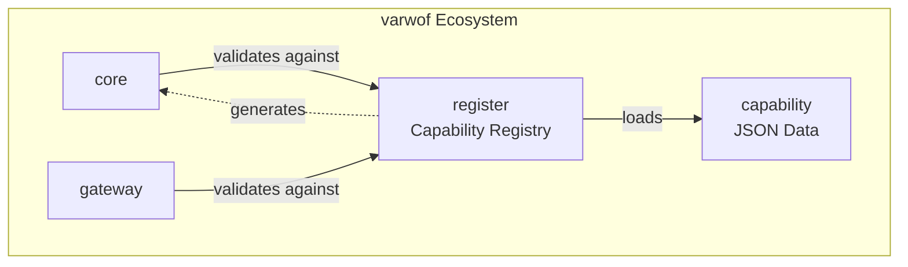

# varwof-register

> Capability Registry — standard capability definition, validation, and authz.json generation for fine-grained AI Agent permission control.

> ⚠️ **Preview** — Not for production use. APIs and features may change before official release.

[](LICENSE)
[](https://pkg.go.dev/github.com/varwof/register)

[中文](README_CN.md)

## What is varwof-register?

A registry of standard capability definitions for fine-grained AI Agent permission control. Capability specifications are carried by **executable JSON files** (capability.json), support PKCS#7 signatures, and can **generate authz.json authorization policies** (gen-authz tool).

## Quick Start

```bash
cd register

# Capability data lives in the sibling capability module.
export CAPABILITY_DIR=../capability/data

# List all capabilities
go run ./cmd/gen-authz -list $CAPABILITY_DIR/varwof/core/v1.json

# Generate authz.json
go run ./cmd/gen-authz -out /tmp/authz.json $CAPABILITY_DIR/varwof/core/v1.json

# Validate / search capabilities
go run ./demo -data $CAPABILITY_DIR validate varwof/core:cert:issue
go run ./demo -data $CAPABILITY_DIR search issue
```

## Installation

```bash
go get github.com/varwof/register@v0.1.0
```

## Directory Structure

```
register/
├── semantics/        # CLC-v1 decision layer (grammar, entailment, decision)
├── ruleexec/         # execution layer (rules, conditions, flow, budgets, SQL)
├── schema.go / registry.go / validator.go / mincap.go
├── genauthz.go / gendocs.go / sign.go / loader.go / params_validate.go
├── cmd/{gen-authz,gen-docs,gen-capability,gen-backfill,gen-rule,sign,verify,vectors-run}/
├── demo/             # capability demo (needs -data <capability data dir>)
├── demo/rule-exec/   # rule-exec e2e demo + rule.schema.json + TS mirror
├── docs/             # user docs
└── dev-docs/         # developer docs
```

Capability definitions themselves are **not** in this repository; they live in
the separate `capability` module (`../capability/data/<vendor>/<product>/v*.json`).

## CLC-v1 semantics (`semantics/`) and conformance runner

`semantics/` is the Go reference implementation of CLC-v1:

| Function | Purpose |
|---|---|
| `ValidateCapabilityID` | §3 grammar (v1: literal + trailing `*` only) |
| `Entails(grant, op)` | authorization binding (§6) |
| `Intersect(grants...)` | effective grant set (§7) |
| `Authorize(grant, op)` | decision function (§9) |
| `CanonicalJSON` | JCS canonicalization for digests |

Failures are fail-closed and carry stable reason codes (§9.4); when several
conditions fail, the normative ordering (§9.3) selects the single reported code.

Run the shared conformance vectors — **verdict and normative reason are both
asserted, and the process exits non-zero on any mismatch**:

```bash
CLC_VECTORS=../capability/data/_vectors/clc-v1/vectors.json go run ./cmd/vectors-run/
```

CI (`.github/workflows/clc-conformance.yml`) clones `varwof/capability` and runs
`gofmt` / `go vet` / `go test` / the vectors on every push and pull request.

## Execution layer (`ruleexec/`)

`ruleexec` runs **signed rules**: `op | if | seq` control flow over runtime
context conditions, a fixed budget (steps / depth / nesting) and fully
parameterized SQL generation. The execution language deliberately contains
**no loops, no retries, no `time-in` and no `contains`** — those belong to the
caller/job orchestrator or to authorization constraints.

- [docs/capability-language-layers.md](docs/capability-language-layers.md) — one
  language, two layers; the rule publication boundary (`RuleWithinSignerGrant`).
- [docs/rule-authoring.md](docs/rule-authoring.md) — how to write a rule file:
  fields, the closed operator set, the parameter contract, the gate matrix.
- [docs/toolchain.md](docs/toolchain.md) — end-to-end flow and every tool
  (`gen-rule` included) with its usage.
- [docs/condition-semantics.md](docs/condition-semantics.md) — null / type /
  case / SQL mapping rules and the shared test vectors.

## Ecosystem



register is the **capability specification layer** of the varwof ecosystem, connecting capability (data) with core/gateway (runtime validation). This project is a member of the [Open Invention Network](https://openinventionnetwork.com/).

## Links

| | |
|---|---|
| Homepage | https://varwof.com |
| Community | https://varwof.org |
| IETF Draft | [draft-wei-aic-identity-cert](https://datatracker.ietf.org/doc/draft-wei-aic-identity-cert/) |
| License | Apache-2.0 |
| Member | [Open Invention Network](https://openinventionnetwork.com/) |
