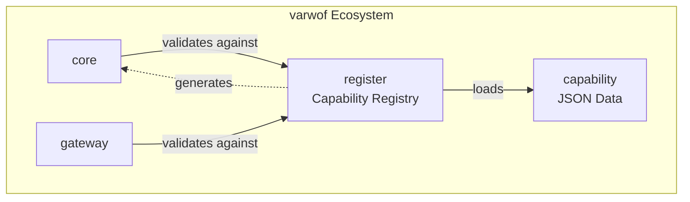

# varwof-register

> ⭐ Like this repo? Give a star to the flagship one:
> [](https://github.com/varwof/core)

> Capability Registry — standard capability definition, validation, and authz.json generation for fine-grained AI Agent permission control.

> ⚠️ **Preview** — Not for production use. APIs and features may change before official release.

[](LICENSE)
[](https://pkg.go.dev/github.com/varwof/register)

[中文](README_CN.md)

## What is varwof-register?

A registry of standard capability definitions for fine-grained AI Agent permission control. Capability specifications are carried by **executable JSON files** (capability.json), support PKCS#7 signatures, and can **generate authz.json authorization policies** (gen-authz tool).

## Quick Start

```bash
cd register

# Capability data lives in the sibling capability module.
export CAPABILITY_DIR=../capability/data

# List all capabilities
go run ./cmd/gen-authz -list $CAPABILITY_DIR/varwof/core/v1.json

# Generate authz.json
go run ./cmd/gen-authz -out /tmp/authz.json $CAPABILITY_DIR/varwof/core/v1.json

# Validate / search capabilities
go run ./demo -data $CAPABILITY_DIR validate varwof/core-v1:cert:issue
go run ./demo -data $CAPABILITY_DIR search issue
```

## Installation

```bash
go get github.com/varwof/register@v0.1.0
```

## Directory Structure

```
register/
├── semantics/        # CLC-v1 decision layer (grammar, entailment, decision)
├── ruleexec/         # execution layer (rules, conditions, flow, budgets, SQL)
├── schema.go / registry.go / validator.go / mincap.go
├── genauthz.go / gendocs.go / sign.go / loader.go / params_validate.go
├── cmd/{gen-authz,gen-docs,gen-capability,gen-backfill,gen-rule,sign,verify,vectors-run}/
├── demo/             # capability demo (needs -data <capability data dir>)
├── demo/rule-exec/   # rule-exec e2e demo + rule.schema.json + TS mirror
├── docs/             # user docs
└── dev-docs/         # developer docs
```

Capability definitions themselves are **not** in this repository; they live in
the separate `capability` module (`../capability/data/<vendor>/<product>/v*.json`).

## Provenance and licensing

`semantics/` and the rest of this repository are written from published
specifications and this project's own language text; **no third-party code was
copied**.  Where a specification's rule is normative here, it is cited by
section and restated in this project's own words rather than reproduced, and the
Internet-Drafts referred to are referenced as work in progress, not as normative
sources.  The conformance corpora live in
[`varwof/capability`](https://github.com/varwof/capability) (`data/_vectors/clc-v1/`).

## CLC-v1 semantics (`semantics/`) and conformance runner

Two orthogonal axes, not a stack: the **decision axis** decides whether a call
counts as doing something that was authorized, the **execution axis** decides
whether to act now and what to record.  CLC owns the decision axis; `ruleexec/`
owns the execution axis (see [docs/capability-language-layers.md](docs/capability-language-layers.md)).
Across both run the **authorization face** ("what may be done") and the
**evidence face** ("what was done, and the evidence for it").  A draft such as
ACA is a *composition contract* over these two axes, not a third layer.

`semantics/` is the Go reference implementation of CLC-v1, in two groups:

**Core semantics** — required by the conformance classes:

| Function | Purpose |
|---|---|
| `ValidateCapabilityID` | §3 grammar (v1: literal + trailing `*` only) |
| `Entails(grant, op)` | authorization binding (§6) |
| `Intersect(grants...)` | effective grant set (§7) |
| `Authorize(grant, op)` | decision function (§9) |
| `Combine(alg, decisions...)` | conflict resolution across sources (default `deny-overrides`) |
| `Discharge(decision, understood)` | consumer-side obligation rule (§8.4 + XACML §2.13/§7.2.1) |
| `EvaluateEvidenceConstraint` | evidence-side value grammar and three-valued evaluation (§8.2/§10) |
| `Requirement` / `EvaluateRequirement` | the relying party's sufficiency bar (`CLC-REQUIREMENT-v1`) |
| `ComputeActionID` / `Match` | instance identity and binding (§4.2/§6.4) |
| `CanonicalJSON` | JCS canonicalization for digests |

**Optional profile** — carried, not required: a deployment that only decides
online pays none of this.  Everything here is off unless a caller turns it on:

| Function | Purpose |
|---|---|
| `Record` / `RecordWith` | Decision Record: frozen inputs + verdict, independently re-computable |
| `RecordWithContext` / `VerifyAsOf` | RATS §10 freshness input (explicit clock / nonce / epoch) |
| `SourceChain` / `StandingOn` | the authorization sources a decision rested on (byte-backed edges) |
| `Envelope` / `PAE` | DSSE + in-toto transport for a record (`cmd/record -envelope`) |
| `BuildChallengeFromDecision` | the machine-readable "what is still missing" (`CLC-CHALLENGE-v1`) |
| `DecisionRecord.Verify()` | re-run the language over a record and check digest, verdict and residual obligations |

Failures are fail-closed and carry stable reason codes (§9.4); when several
conditions fail, the normative ordering (§9.3) selects the single reported code.

Run the shared conformance vectors — **verdict and normative reason are both
asserted, and the process exits non-zero on any mismatch**:

```bash
CLC_VECTORS=../capability/data/_vectors/clc-v1/vectors.json go run ./cmd/vectors-run/
```

The evidence side has its own corpus and runner (CLC-E, 30 vectors):

```bash
CLC_EVIDENCE_VECTORS=../capability/data/_vectors/clc-v1/evidence-vectors.json go run ./cmd/evidence-vectors-run/
```

Byte budget of the optional artifacts is reproducible (record / envelope /
challenge sizes, and the constraint strings that drive certificate size):

```bash
go run ./cmd/size-report/
```

CI (`.github/workflows/clc-conformance.yml`) clones `varwof/capability` and runs
`gofmt` / `go vet` / `go test` / the vectors on every push and pull request.

### Decision Records (`semantics/record.go`)

`Record` freezes *what was decided* — the canonical inputs, the CLC revision,
the verdict, the reason and the residual obligations — behind a SHA-256 digest
of the inputs, so a holder of the record alone can re-run the same revision and
get the same answer.  `Verify` does exactly that, and fails closed with
`record_input_digest_mismatch`, `record_verdict_mismatch`,
`record_operation_count` or `record_unsupported_revision` on anything that does
not reproduce.

```bash
go run ./cmd/record input.json          # {"grants":[...],"operation":{...}} -> record
go run ./cmd/record -verify record.json # re-run the language over a record
```

Note: `CanonicalJSON` is a simplified JCS (`json.Marshal`), so digests are
comparable between holders of this implementation, not yet with other JCS
implementations.  Constraint *evaluation* results and authorization source
chains are not part of a record yet — see `dev-docs/README.md`.

## Execution layer (`ruleexec/`)

`ruleexec` runs **signed rules**: `op | if | seq` control flow over runtime
context conditions, a fixed budget (steps / depth / nesting) and fully
parameterized SQL generation. The execution language deliberately contains
**no loops, no retries, no `time-in` and no `contains`** — those belong to the
caller/job orchestrator or to authorization constraints.

- [docs/capability-language-layers.md](docs/capability-language-layers.md) — one
  language, two layers; the rule publication boundary (`RuleWithinSignerGrant`).
- [docs/rule-authoring.md](docs/rule-authoring.md) — how to write a rule file:
  fields, the closed operator set, the parameter contract, the gate matrix.
- [docs/toolchain.md](docs/toolchain.md) — end-to-end flow and every tool
  (`gen-rule` included) with its usage.
- [docs/condition-semantics.md](docs/condition-semantics.md) — null / type /
  case / SQL mapping rules and the shared test vectors.

## Ecosystem



register is the **capability specification layer** of the varwof ecosystem, connecting capability (data) with core/gateway (runtime validation). This project is a member of the [Open Invention Network](https://openinventionnetwork.com/).

## Links

| | |
|---|---|
| Homepage | https://varwof.com |
| Community | https://varwof.org |
| IETF Draft | [draft-wei-aic-identity-cert](https://datatracker.ietf.org/doc/draft-wei-aic-identity-cert/) |
| License | Apache-2.0 |
| Member | [Open Invention Network](https://openinventionnetwork.com/) |
