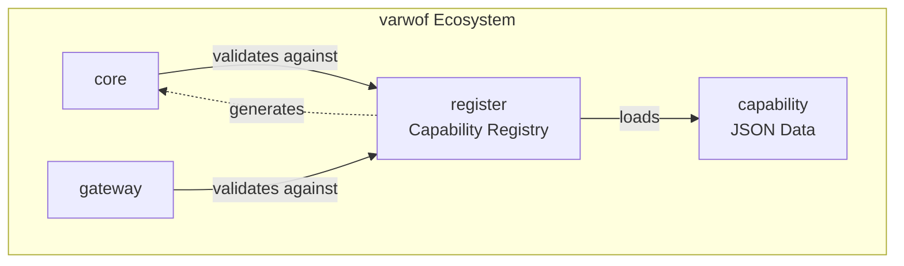

# varwof-register

> Varwof AIC 套件的一部分 —— 旗舰仓库：[aic-agent](https://github.com/varwof/aic-agent) · [aic-verifier](https://github.com/varwof/aic-verifier) · [aic-exec](https://github.com/varwof/aic-exec)

> 能力注册中心 —— AI Agent 细粒度权限控制的标准能力定义、验证与 authz.json 生成。

> ⚠️ **预览版** — 不可用于生产环境。API 和功能可能在正式发布前发生变更。

[](LICENSE)
[](https://pkg.go.dev/github.com/varwof/register)

[English](README.md)

## 什么是 varwof-register？

AI Agent 细粒度权限控制的标准能力定义注册中心。能力规范以**可执行的 JSON 文件**（capability.json）为载体，支持 PKCS#7 签名，并可**生成 authz.json 授权策略**（gen-authz 工具）。

## 快速开始

```bash
cd register

# 能力数据在同级的 capability 模块里。
export CAPABILITY_DIR=../capability/data

# 列出全部能力
go run ./cmd/gen-authz -list $CAPABILITY_DIR/varwof/core-v1/v1.json

# 生成 authz.json
go run ./cmd/gen-authz -out /tmp/authz.json $CAPABILITY_DIR/varwof/core-v1/v1.json

# 校验 / 检索能力
go run ./demo -data $CAPABILITY_DIR validate varwof/core-v1:cert:issue
go run ./demo -data $CAPABILITY_DIR search issue
```

能力文件的寻址形式是 `<厂商>/<产品>-v<主版本>/v<主版本>.json`，所以上面的路径带有 `-v1`
产品后缀。

## 安装

```bash
go get github.com/varwof/register@v0.8.0
```

## 目录结构

```
register/
├── semantics/        # CLC-v1 判定层（文法、蕴含、判定）
├── ruleexec/         # 执行层（规则、条件、流、预算、SQL）
├── schema.go / registry.go / validator.go / mincap.go
├── genauthz.go / gendocs.go / sign.go / loader.go / params_validate.go
├── cmd/              # 工具与一致性 runner（见下表）
├── demo/             # 能力 demo（需要 -data <能力数据目录>）
├── demo/rule-exec/   # rule-exec 端到端 demo + rule.schema.json + TS 镜像
├── docs/             # 用户文档
└── dev-docs/         # 开发者文档
```

### 命令行工具

| 命令 | 用途 |
|---|---|
| `gen-authz` | 由能力 scheme 生成 `authz.json`（`-list` 打印该 scheme） |
| `gen-docs` | 渲染能力文档 |
| `gen-capability` | 为新能力 scheme 生成脚手架 |
| `gen-backfill` | 向既有 scheme 回填派生字段 |
| `gen-rule` | 用签名者授予对 `ruleexec` 规则签名 |
| `sign` / `verify` | 对能力文件做 PKCS#7 签名 / 验签 |
| `record` | 创建并重新验证决策记录（`-verify`、`-envelope`） |
| `size-report` | 可选产物的字节预算（记录 / 信封 / 挑战） |
| `vectors-run` | CLC-A 授权语料 |
| `evidence-vectors-run` | CLC-E 证据语料 |
| `crosswalk-vectors-run` | 载体绑定 crosswalk 语料 |
| `resolve-vectors-run` | §8.5 `Resolve` 语料 |
| `param-bounds-vectors-run` | §6.5 参数界语料 |
| `param-bounds-meet-vectors-run` | §6.6 `BoundMeet` 语料 |
| `constraint-union-vectors-run` | §7.1 `ConstraintUnion` 语料 |
| `contains-vectors-run` | §13 `Contains` 包含关系语料 |
| `contains-crosswalk-run` | CLC-D 跨厂商包含 crosswalk 语料 |
| `authorize-chain-vectors-run` | §13.11 `AuthorizeWithChain` 语料 |
| `semantics/fuzz_runner` | 差分模糊测试目标（读取 JSONL 用例文件） |

每个 runner 都从环境变量读取自己的语料，**任何不一致都会非零退出**；见[一致性语料](#一致性语料)。

能力定义本身**不在本仓库**，而在独立的
[`varwof/capability`](https://github.com/varwof/capability) 模块
（`data/<厂商>/<产品>-v<主版本>/v<主版本>.json`）。

## 出处与许可

`semantics/` 及本仓库其余部分均依据公开规范与本项目自有语言文本写成，**未复制任何第三方代码**。
某条规范规则在本项目具有规范性时，按章节引用并以本项目自己的话重述，而非照抄；所引
Internet-Draft 一律以 work in progress 形式列出，不作为规范性来源。一致性语料位于
[`varwof/capability`](https://github.com/varwof/capability)（`data/_vectors/clc-v1/`）。

## CLC-v1 语义实现（`semantics/`）与一致性 runner

两条正交轴，而非堆叠：**判定轴**决定一次调用是否算做了被授权的事，**执行轴**决定现在是否
动手、以及记录什么。CLC 拥有判定轴，`ruleexec/` 拥有执行轴（见
[docs/capability-language-layers.md](docs/capability-language-layers.md)）。
两条轴上都跑**授权面**（"允许做什么"）与**证据面**（"做了什么，以及证据"）。像 ACA 这样的
草案是这两条轴之上的*组合契约*，不是第三层。

`semantics/` 是 CLC-v1 的 Go 参考实现，分三组：

**核心语义** —— 一致性类别所要求的部分：

| 函数 | 用途 |
|---|---|
| `ValidateCapabilityID` | §3 文法（v1：仅字面量与结尾 `*`） |
| `Entails(grant, op)` | 授权绑定（§6） |
| `Intersect(grants...)` | 有效授权集（§7） |
| `ConstraintUnion(chain...)` | 链的派生约束投影（§7.1） |
| `Authorize(grant, op)` | 判定函数（§9） |
| `Combine(alg, decisions...)` | 跨来源的冲突消解（默认 `deny-overrides`） |
| `Discharge(decision, understood)` | 消费方侧的义务规则（§8.4 + XACML §2.13/§7.2.1） |
| `EvaluateEvidenceConstraint` | 证据侧值文法与三值求值（§8.2/§10） |
| `Requirement` / `EvaluateRequirement` | 依赖方的充分性门槛（`CLC-REQUIREMENT-v1`） |
| `ComputeActionID` / `Match` | 实例身份与绑定（§4.2/§6.4） |
| `CanonicalJSON` | 用于摘要的 JCS 规范化 |

**委派包含（CLC-D）** —— 链这一面，`§13`：

| 函数 | 用途 |
|---|---|
| `Contains(parent, child)` | `(标识, 参数)` 上的包含关系（§13.4–§13.5） |
| `AuthorizeWithChain(chain, op)` | 融合链检查：逐跳 `Contains`，再 `Authorize(Intersect(chain))`（§13.11） |

**输入边界** —— params 对象在任何层运行之前必须满足的条件。跳过这些的调用方得不到
§9.3 的保护：

| 函数 | 用途 |
|---|---|
| `ValidateRawParams(raw)` | 原始文本入口（§6.2、§9.3 第 2 层）：大小/深度、重复键、数值形状、非法 Unicode |
| `ValidateGrantParams` / `ValidateOperationParams` | 解码对象入口（§6.2 第 6 步），作用于 `map[string]any` |
| `ValidateParamBounds(bounds, params)` | `param_bounds` 的单表示绑定规则（§6.5） |
| `ValidateConstraint(c)` | 约束文法与已知类型（§8.1） |

两个参数入口施加同样的 §6.2 上限与同样的 `invalid_params_number` 拒绝，因此落在
I-JSON 互操作范围之外（幅值超过 2^53 − 1）的整数在任一入口都是被拒绝，而不是被四舍五入。

**可选 profile** —— 随记录携带而非必需：只做在线判定的部署完全不为这些付费。除非调用方
显式开启，下面一切都处于关闭状态：

| 函数 | 用途 |
|---|---|
| `Record` / `RecordWith` | 决策记录：冻结输入 + verdict，可独立重算 |
| `RecordWithContext` / `VerifyAsOf` | RATS §10 新鲜度输入（显式时钟 / nonce / epoch） |
| `SourceChain` / `StandingOn` | 判定所依据的授权来源（字节支撑的边） |
| `Envelope` / `PAE` | 记录的 DSSE + in-toto 传输（`cmd/record -envelope`） |
| `BuildChallengeFromDecision` | 机器可读的"还缺什么"（`CLC-CHALLENGE-v1`） |
| `DecisionRecord.Verify()` | 在记录上重跑语言，并核对摘要、verdict 与残余义务 |

失败一律 fail-closed，并携带稳定错误码（§9.4）；多个条件同时失败时，按规范顺序（§9.3）
选出唯一上报的码。

本实现所声明的修订号由 Go 常量 `semantics.CLCRevision` 给出 —— 它是该修订号的唯一来源
—— 并采用 §12.1 的兼容读法：所声明主版本号与我们相同、且声明的次版本号 ≤ 我们的输入，
正常求值；更高的次版本号 fail-closed，报 `unsupported_language_revision`。绝不静默降级。

### 一致性语料

每份语料都发布在 [`varwof/capability`](https://github.com/varwof/capability) 的
`data/_vectors/` 下，每个 runner 都**同时断言 verdict 与规范 reason，并在任何不一致时
非零退出**。用 runner 读取的环境变量把语料指给它：

```bash
export CLC_VECTORS=../capability/data/_vectors/clc-v1/vectors.json
go run ./cmd/vectors-run/
```

| 语料 | 用例数 | Runner | 环境变量 |
|---|---|---|---|
| `clc-v1/vectors.json` | 146 | `cmd/vectors-run` | `CLC_VECTORS` |
| `clc-v1/evidence-vectors.json` | 32 | `cmd/evidence-vectors-run` | `CLC_EVIDENCE_VECTORS` |
| `clc-v1/crosswalk-vectors.json` | 13 | `cmd/crosswalk-vectors-run` | `CLC_CROSSWALK_VECTORS` |
| `clc-v1/param-bounds-vectors.json` | 43 | `cmd/param-bounds-vectors-run` | `CLC_PARAM_BOUNDS_VECTORS` |
| `clc-v1/param-bounds-meet-vectors.json` | 27 | `cmd/param-bounds-meet-vectors-run` | `CLC_PARAM_BOUNDS_MEET_VECTORS` |
| `clc-v1/constraint-union-vectors.json` | 12 | `cmd/constraint-union-vectors-run` | `CLC_CONSTRAINT_UNION_VECTORS` |
| `clc-v1/resolve-vectors.json` | 26 | `cmd/resolve-vectors-run` | `CLC_RESOLVE_VECTORS` |
| `clc-d/containment-vectors.json` | 64 | `cmd/contains-vectors-run` | `CLC_D_VECTORS` |
| `clc-d/containment-crosswalk-vectors.json` | 44 | `cmd/contains-crosswalk-run` | `CLC_D_CROSSWALK_VECTORS` |
| `clc-d/authorize-chain-vectors.json` | 15 | `cmd/authorize-chain-vectors-run` | `CLC_AUTHORIZE_CHAIN_VECTORS` |

CLC-A 一组还带有 §7.1 UTF-8 排序（2 条）与 §6.5 类型敏感相等（11 条）用例，以及属性语料
（1184 条 P11 用例、500 条 meet 不变式用例、784 条包含闭包用例）—— 它们从
`go test ./semantics/` 运行，而不是独立的 runner。

这些语料是**可移植的**：同一批文件被其他同作者实现消费，因此分歧在两侧都看得见 ——

| 实现 | 语言 | 入口 |
|---|---|---|
| [`varwof/register`](https://github.com/varwof/register) | Go | 本模块，`cmd/*-run` |
| [`varwof/aic-capability-demo`](https://github.com/varwof/aic-capability-demo) | Python | `vectors-run.py`、`property_test.py` |
| [`varwof/aic-capability-demo/ts`](https://github.com/varwof/aic-capability-demo/tree/main/ts) | TypeScript | `ts/*-run.ts`（Node，零依赖） |

CI（`.github/workflows/clc-conformance.yml`）克隆 `varwof/capability`，在每次 push 与 PR
上运行 `gofmt` / `go vet` / `go test` 以及全部 runner。

### 输入边界

两个参数入口施加同样的 §6.2 上限与同样的 `invalid_params_number` 拒绝，因此落在
I-JSON 互操作范围之外（幅值超过 2^53 − 1）的整数在任一入口都是被拒绝，而不是被四舍五入。
该界同样覆盖 `max_rows` 的**约束操作数** —— §8.1 不豁免它受第 7 层闭包约束 —— 超界的
上限值以 `invalid_constraint`（§8.1 的 reason code）拒绝。

### 决策记录（`semantics/record.go`）

`Record` 把*决定了什么*冻结下来 —— 规范化输入、CLC 修订号、verdict、reason 与残余义务
—— 置于输入的 SHA-256 摘要之后，因此仅持有记录的一方也能重跑同一修订号并得到同一答案。
`Verify` 正是如此，并在无法复现时以 `record_input_digest_mismatch`、
`record_verdict_mismatch`、`record_operation_count` 或 `record_unsupported_revision`
fail-closed。

```bash
go run ./cmd/record input.json          # {"grants":[...],"operation":{...}} -> record
go run ./cmd/record -verify record.json # 在记录上重跑语言
```

注意：`CanonicalJSON` 实现的是 **RFC 8785（JCS）** —— 对象成员按 UTF-16 码元排序、
`§3.2.2.2` 字符串转义、ECMAScript `Number::toString` —— 因此 `clc-action:` 标识与决策记录
摘要可与任何其他 JCS 实现保持一致。（在 rev CLC-1.6 之前用的是 `json.Marshal`，其 HTML
转义会让 `&`/`<`/`>` 的摘要不符合 JCS。）约束*求值*结果与授权来源链尚不属于记录的一部分
—— 见 `dev-docs/README.md`。

## 执行层（`ruleexec/`）

`ruleexec` 执行**签名规则**：在运行上下文条件之上的 `op | if | seq` 控制流、固定预算
（步数 / 深度 / 嵌套）与全量参数化的 SQL 生成。执行语言刻意**不含循环、不含重试、不含
`time-in` 与 `contains`** —— 它们分别属于调用方/作业编排层和授权约束。

- [docs/capability-language-layers.md](docs/capability-language-layers.md) —— 一门语言两层、
  规则发布边界（`RuleWithinSignerGrant`）。
- [docs/rule-authoring.md](docs/rule-authoring.md) —— 如何写规则文件：字段、封闭算子集、
  参数契约、闸门矩阵。
- [docs/toolchain.md](docs/toolchain.md) —— 端到端流程与每个工具（含 `gen-rule`）的用法。
- [docs/condition-semantics.md](docs/condition-semantics.md) —— null / 类型 / 大小写 / SQL 映射
  规则与共享测试向量。

## 生态



register 是 varwof 生态的**能力规范层**，把 capability（数据）与 core/gateway（运行时验证）
连接起来。本项目是 [Open Invention Network](https://openinventionnetwork.com/) 成员。

### 相关仓库

| 仓库 | 是什么 |
|---|---|
| [`varwof/capability`](https://github.com/varwof/capability) | 能力数据、CLC-v1 规范文本，以及本模块读取的全部一致性语料（[English](https://github.com/varwof/capability/blob/main/README.md)） |
| [`varwof/aic-capability-demo`](https://github.com/varwof/aic-capability-demo) | 消费同一批语料的 Python 与 TypeScript 移植（[English](https://github.com/varwof/aic-capability-demo/blob/main/README.md)） |

## 链接

| | |
|---|---|
| 主页 | https://varwof.com |
| 社区 | https://varwof.org |
| IETF 草案 | [draft-wei-aic-identity-cert](https://datatracker.ietf.org/doc/draft-wei-aic-identity-cert/) |
| 许可证 | Apache-2.0 |
| 成员 | [Open Invention Network](https://openinventionnetwork.com/) |